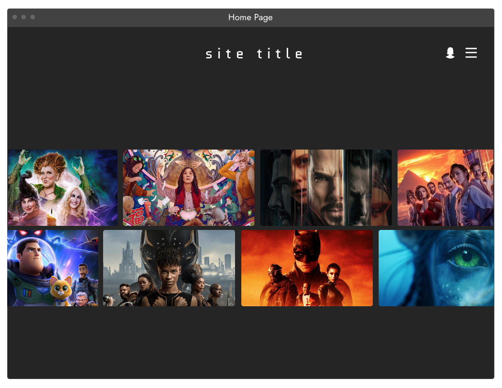
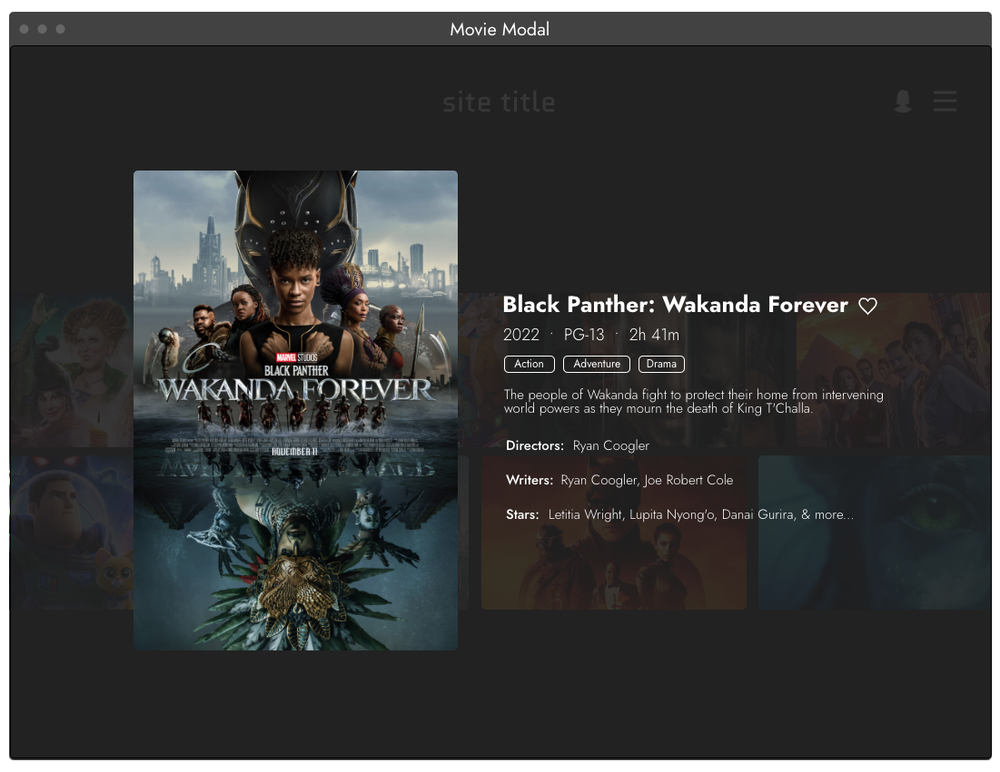
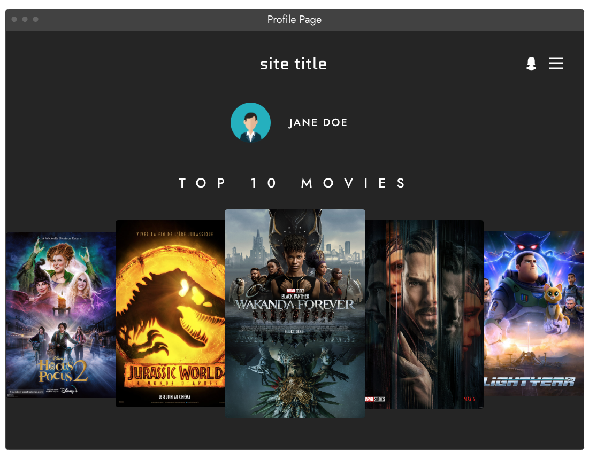
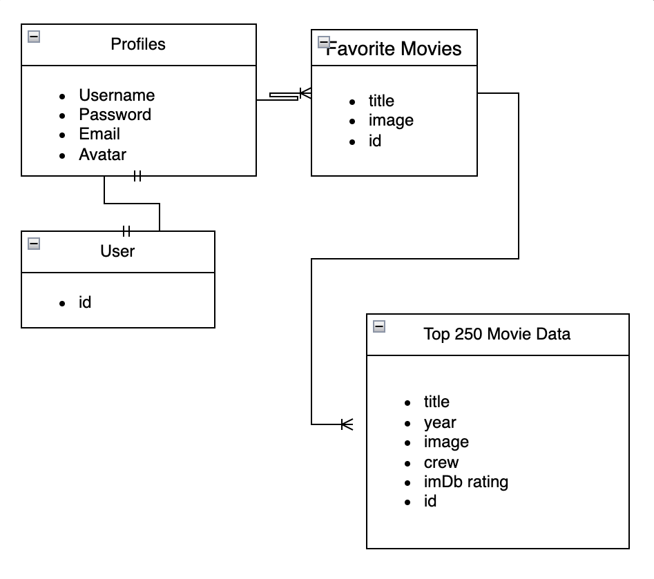
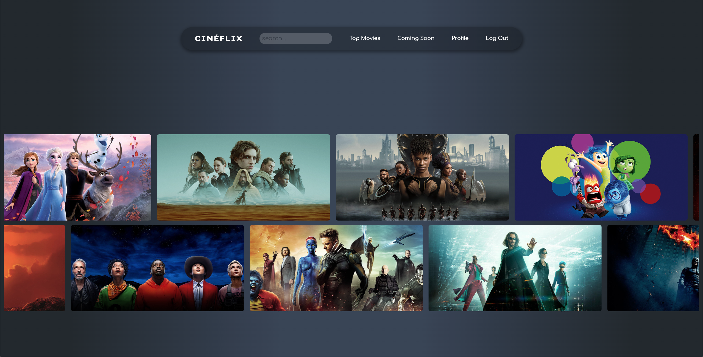
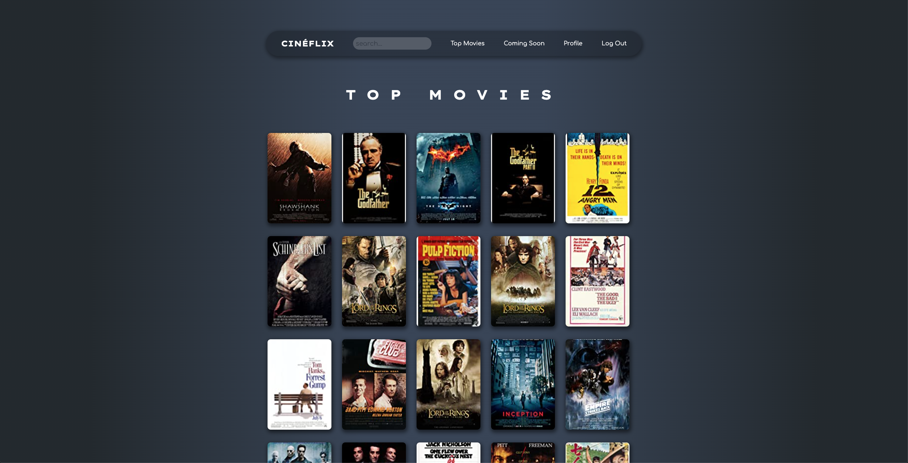
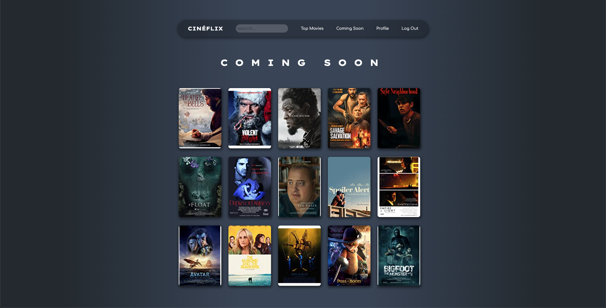
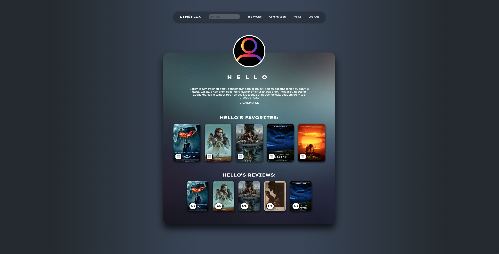

    

#

### [CLICK TO DEMO](https://cineflixapp.herokuapp.com/)

##### Created by Studio 4

## :pencil: Description

Cinéflix is a social media-based web application designed for bringing movie-lovers together to share their passion & opinions on cinema.

#

    
:art: Wireframes

        

        

        

    
:file_folder: ERD

        

    
:gear: Functionality

        <h3 align="center">Home Page</h3>
        

        <h3 align="center">Top Movies</h3>
        

        <h3 align="center">Coming Soon</h3>
        

        <h3 align="center">Movie Details</h3>
        

        <h3 align="center">Profile Page</h3>
        

## :computer: Technologies Used

## :link: Links

  
Trello Board

  <a href="https://trello.com/b/xCLDzBS4/cin%C3%A9flix">Click here!</a>

  
Deployed Link

  <a href="https://cineflixapp.herokuapp.com/">Cinéflix</a>

## :fast_forward: Next Steps

### Upcoming Features

- [ ] Allow users to personalize their profile.

- [ ] Implement a Watch List that users can add corresponding movies to.

- [ ] Utilize AWS S3 to allow users to upload images/avatars.